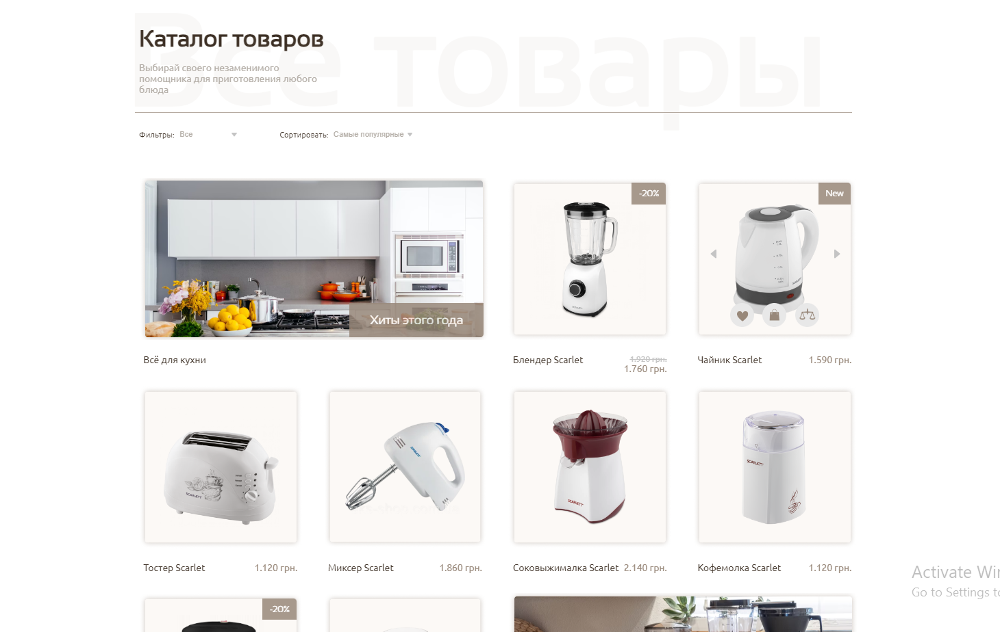

# Project Title: MIR electro

## Description
MIR electro - Household Appliances Online Store

MIR electro is an online store that offers customers the convenience of quickly purchasing a variety of household appliances and electronics. The project is built using modern web development technologies to ensure user convenience and efficiency.

## Key Features

### Navigation Panel

The website features an intuitive navigation panel that allows users to easily navigate between different pages and sections of the site.

### New Products Slider

The homepage includes a slider that allows users to view the latest products and promotions available in the store. This helps to engage users and draw their attention to current offers.

### Product Catalog

The store boasts an extensive product catalog that includes a wide range of household appliances. Each product is presented with a detailed description, specifications, and photographs, enabling users to make informed choices.

### Contact Information

Contact information is provided on the website, allowing users to get in touch with customer support or obtain additional information about products and services.

### Call Back Request Form

Users can leave their contact details and request a callback. This allows them to receive consultation and assistance from store experts.

## Technologies Used
- HTML, SCSS: For styling and layout.
- React.js: For building a dynamic and interactive user interface.
- React Hook Form and Yup: For creating and validating form.
- REST API: For data communication and handling server requests.

## Installation
1. Clone the repository:
`git clone https://github.com/IrynaBalandiukh/mir-electro-frontend.git`

2. Install dependencies:
`cd mir-electro-frontend`
`npm install`

3. Run the development server:
`npm start`
Open [http://localhost:3000](http://localhost:3000) to view it in the browser.

## Demo
Check out the live demo of the ToDo App [here](https://irynabalandiukh.github.io/mir-electro-frontend/).

## Screenshots

